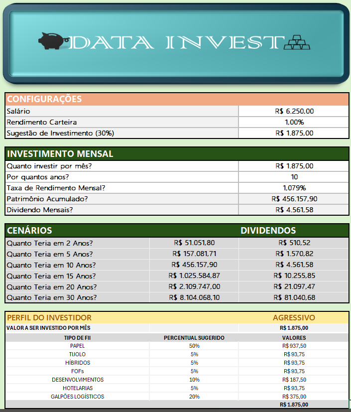

# 📊 Simulador de Investimento em Fundos Imobiliários (FIIs) no Excel 📈

## 📝 Sumário

* [Sobre o Projeto](#sobre-o-projeto)
* [✨ Funcionalidades](#-funcionalidades)
* [🖼️ Screenshot do Projeto](#️-screenshot-do-projeto)
* [🛠️ Tecnologias Utilizadas](#️-tecnologias-utilizadas)
* [🚀 Como Utilizar](#-como-utilizar)
    * [Pré-requisitos](#pré-requisitos)
    * [Passo a Passo](#passo-a-passo)
* [🧠 Principais Aprendizados](#-principais-aprendizados)
* [🤝 Contribuições](#-contribuições)
* [👤 Autor](#-autor)
* [🙏 Agradecimentos](#-agradecimentos)
* [📜 Licença](#-licença)

## Sobre o Projeto

Este projeto é um **Simulador de Investimento em Fundos de Investimento Imobiliário (FIIs)** desenvolvido em Microsoft Excel. O objetivo principal é permitir que o usuário possa simular diferentes cenários de investimento, analisando o potencial de rendimento, o impacto dos aportes mensais e a evolução do patrimônio ao longo do tempo.

A ferramenta foi criada como parte do **Bootcamp Santander** em parceria com a **Digital Innovation One (DIO)**, visando aplicar conceitos de finanças e o uso avançado do Excel para a criação de soluções práticas e analíticas.

## ✨ Funcionalidades

* **Cadastro de FIIs:** Permite inserir informações básicas dos FIIs (Ticker, Preço da Cota, Dividendo por Cota).
* **Simulação de Aportes:** O usuário pode definir o valor do aporte inicial e aportes mensais.
* **Cálculo de Rendimentos:** Calcula automaticamente os dividendos recebidos com base nos FIIs e na quantidade de cotas.
* **Projeção de Patrimônio:** Mostra a evolução do patrimônio ao longo de um período determinado.
* **Reinvestimento de Dividendos:** Opção para simular o reinvestimento automático dos dividendos recebidos.
* **Visualização Gráfica:** Apresenta gráficos para facilitar a análise da evolução dos investimentos e rendimentos.
* **Interface Intuitiva:** Design pensado para facilitar a navegação e o uso por qualquer pessoa, mesmo sem conhecimento avançado em Excel.

## 🖼️ Screenshot do Projeto

Aqui você pode ver uma prévia da interface principal do simulador:




## 🛠️ Tecnologias Utilizadas

* **Microsoft Excel:**
    * Fórmulas Avançadas (SE, SOMASES, PROCX/PROCV, ÍNDICE, CORRESP, etc.)
    * Tabelas Dinâmicas (opcional, se utilizado)
    * Formatação Condicional
    * Validação de Dados

## 🚀 Como Utilizar

### Pré-requisitos

* Ter o **Microsoft Excel** instalado (preferencialmente versão 2013 ou superior para garantir compatibilidade com todas as funcionalidades).
* Habilitar macros, caso o projeto utilize VBA.

### Passo a Passo

1.  **Clone o repositório** (ou faça o download do arquivo `.xlsx`):
    ```bash
    git clone [https://github.com/SEU_USUARIO/NOME_DO_SEU_REPOSITORIO.git](https://github.com/Campos-DataAnalyst/projeto-simulador-investimentos-bootcamp-santander.git)
    ```
2.  **Abra o arquivo** `PROJETO_DATA_INVEST.xlsx` (ou o nome que você deu ao seu arquivo) no Microsoft Excel.
3.  **Navegue pelas abas/planilhas:**
    * **Dados Iniciais/Configurações:** Insira os dados dos FIIs que deseja simular (Tipo, Preço, Dividendo).
    * **Simulador:** Preencha os campos de aporte inicial, aportes mensais, período da simulação.
4.  **Interaja com os campos editáveis** para testar diferentes cenários de investimento.

## 🧠 Principais Aprendizados

Durante o desenvolvimento deste projeto, foram explorados e aprofundados conhecimentos em:

* **Modelagem Financeira no Excel:** Estruturação de cálculos complexos para simulações de investimentos.
* **Lógica de Programação (com Fórmulas):** Criação de fluxos condicionais e cálculos dinâmicos.
* **Análise de Dados:** Interpretação de resultados e projeções financeiras.
* **Visualização de Dados:** Uso de gráficos para apresentar informações de forma clara e objetiva.
* **Boas Práticas em Excel:** Organização de planilhas, nomeação de células e intervalos, e criação de interfaces amigáveis.

## 🤝 Contribuições

Contribuições são bem-vindas! Se você tiver sugestões para melhorar este simulador, sinta-se à vontade para abrir uma *issue* ou enviar um *pull request*.

1.  Faça um *Fork* do projeto.
2.  Crie uma *Branch* para sua modificação (`git checkout -b feature/NovaFuncionalidade`).
3.  Faça o *Commit* de suas mudanças (`git commit -m 'Adicionando NovaFuncionalidade'`).
4.  Faça o *Push* da *Branch* (`git push origin feature/NovaFuncionalidade`).
5.  Abra um *Pull Request*.

## 👤 Autor

* **[PEDRO DE CAMPOS]**
    * LinkedIn: [[SEU LINKEDIN AQUI](https://www.linkedin.com/in/pedro-de-campos-dev/)]
    * GitHub: [@SEU_USUARIO_GITHUB_AQUI]
    * DIO: [Placeholder para Perfil da DIO](./assets/mEU_pERFIL_dio.png)

## 🙏 Agradecimentos

* Agradeço ao **Santander** e à **Digital Innovation One (DIO)** pela oportunidade de participar deste bootcamp e desenvolver este projeto.
* Aos instrutores e mentores do bootcamp pelo conhecimento compartilhado.

---

Feito com ❤️ e muito Excel!
